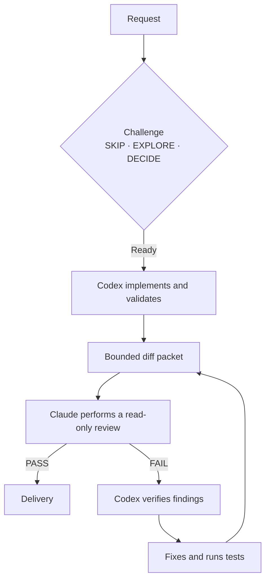

# Codex + Claude Review Gate

<p align="center">
  <a href="README.md"><kbd>🇫🇷 Français</kbd></a>
  &nbsp;
  <a href="README.en.md"><kbd>🇬🇧 English</kbd></a>
</p>

A local, public, portable workflow for letting Codex and Claude collaborate in a Git repository without assigning them the same role: **Codex is the only writer; Claude is an independent, read-only reviewer.**

The project collects no data and includes no key, account, or machine-specific path. Review logs remain on the computer that runs the command.

## Why this workflow?

A model that implements a change and then reviews itself tends to share its own blind spots. This loop separates responsibilities: Codex builds and tests the change, Claude looks for reproducible defects within a bounded scope, and Codex verifies every finding before making a correction.



This diagram is the workflow wireframe: it shows handoffs, the single correction loop, and the fact that Claude never writes.

## Installation

Requirements: macOS or Linux, Git, Python 3, `jq`, and authenticated Codex and Claude CLIs. Claude must have a configuration that denies write tools; see the [security configuration](docs/security.en.md).

```bash
git clone https://github.com/YOUR_ORG/codex-claude-review-gate.git
cd codex-claude-review-gate
bash install.sh
ai-review-loop --repo /path/to/a/project --dry-run
```

The installer copies resources to `~/.local/share/codex-claude-review-gate` and creates `ai-review-loop` and `ai-review-await` in `~/.local/bin`. Add that directory to `PATH` if needed.

## Daily use

At the end of a substantial change in an interactive Codex session:

```bash
ai-review-loop --repo . --review-only --report-only
```

- `PASS`: no evidence-backed significant defect was found within scope.
- `FAIL`: open `findings-1.json`, confirm each finding, fix valid findings, run the relevant checks, then run the command again.

Autonomous mode is also available. Codex implements the task, then Claude reviews it. It stops on `FAIL` so a person or active Codex session can assess the evidence:

```bash
ai-review-loop --repo . "Add search to the project list"
```

Force review depth:

```bash
ai-review-loop --repo . --review-only --report-only --fast
ai-review-loop --repo . --review-only --report-only --deep
```

Artifacts are stored under `~/.local/state/codex-claude-review/runs/` with owner-only permissions: manifest, packet, diff, raw output, and validated JSON verdict. They must not be added to an application repository.

## What the gate does

- builds a diff and file list while excluding `.env` files, build artifacts, dependencies, and sensitive hidden files;
- selects `fast` review for small changes and `deep` review for risky areas (authentication, security, persistence, SQL, API), large diffs, or many changes;
- requires a strict JSON schema (`PASS` or `FAIL`, severity, file, line, evidence, and suggested validation);
- creates a per-repository Git lock and rejects a verdict if the worktree changes during the review;
- never commits, pushes, opens pull requests, or deploys.

Challenge and routing rules are provided in [AGENTS.en.md](AGENTS.en.md). Copy that file to a repository that should use the same discipline.

## Model escalation and orchestration

This section documents the workflow actually versioned in this repository. The three skills are included in `.codex/skills/` and become available when Codex opens the repository.

| Stage | Active component | Responsibility |
| --- | --- | --- |
| Framing | `$intent-challenger` | Classifies the request as `SKIP`, `EXPLORE`, or `DECIDE`. |
| Routing | `$adaptive-model-router` | Keeps one writer by default and selects the smallest suitable inference tier only when delegation is justified. |
| Implementation | Codex | The only agent permitted to modify the worktree. |
| Review | `$claude-review-gate` + `ai-review-loop` + Claude | Produces an independent, read-only verdict. |

The versioned router assigns Luna/Low to bounded research or mechanical work, Terra/Medium to normal writing, Terra/High to complex diagnosis or review, and Sol/High only to critical work or a justified escalation. It is a **decision orchestrator**: it chooses the appropriate role and tier, but does not replace the models available in the Codex runtime.

This repository provides the Codex/Claude gate, prompts, all three skills, and documentation. It intentionally excludes Codex and Claude CLIs, their accounts, environment-variable values, secrets, and personal sandbox settings. See the full [architecture](docs/workflow.en.md).

## Important limitations

AI review is an additional safety net, not proof that no bug exists or a full security audit. Fast review is intentionally limited to a diff packet; deep review may read code needed for analysis but remains forbidden from writing and using the network. Keep your usual tests, human reviews, and CI controls.

Read the [architecture](docs/workflow.en.md), [security model](docs/security.en.md), and [contribution guide](CONTRIBUTING.en.md) before changing the runner.

## License

[MIT](LICENSE).
