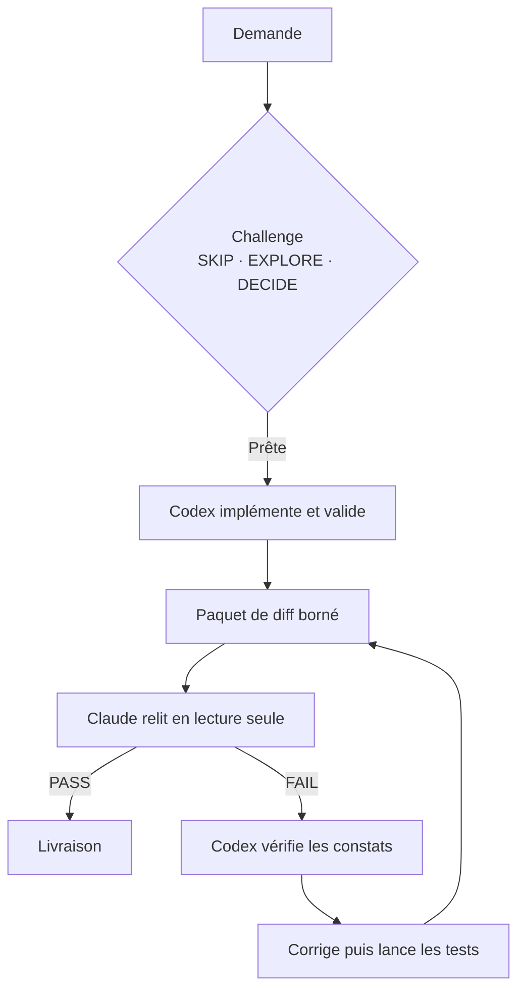

# Codex + Claude Review Gate

<p align="center">
  <a href="README.md"><kbd>🇫🇷 Français</kbd></a>
  &nbsp;
  <a href="README.en.md"><kbd>🇬🇧 English</kbd></a>
</p>

Un workflow local, public et portable pour faire collaborer Codex et Claude sur
un dépôt Git sans leur donner le même rôle : **Codex est l'unique agent qui
écrit ; Claude est un relecteur indépendant en lecture seule.**

Le projet ne collecte aucune donnée et ne contient ni clé, ni compte, ni chemin
propre à une machine. Les journaux de revue restent sur la machine de la
personne qui lance la commande.

## Pourquoi ce workflow ?

Un modèle qui implémente puis « se relit » tend à partager ses propres angles
morts. Cette boucle sépare les responsabilités : Codex produit et teste le
changement, Claude cherche des défauts reproductibles dans un périmètre borné,
puis Codex vérifie les constats avant toute correction.



Le schéma est un wireframe du protocole : il explicite le passage de main,
l'unique boucle de correction et l'absence d'écriture côté Claude.

## Installation

Pré-requis : macOS ou Linux, Git, Python 3, `jq`, le CLI Codex et le CLI Claude
installés et authentifiés. Claude doit disposer d'une configuration qui refuse
les outils d'écriture ; voir [la configuration de sécurité](docs/security.md).

```bash
git clone https://github.com/YOUR_ORG/codex-claude-review-gate.git
cd codex-claude-review-gate
bash install.sh
ai-review-loop --repo /chemin/vers/un-projet --dry-run
```

L'installeur copie les ressources dans `~/.local/share/codex-claude-review-gate`
et crée `ai-review-loop` et `ai-review-await` dans `~/.local/bin`. Ajoute ce
dernier dossier à `PATH` si nécessaire.

## Usage quotidien

Dans une session Codex interactive, après une modification substantielle :

```bash
ai-review-loop --repo . --review-only --report-only
```

- `PASS` : aucun défaut significatif étayé n'a été trouvé dans le périmètre.
- `FAIL` : ouvrir `findings-1.json`, confirmer chaque constat, corriger ceux qui
  sont valides, exécuter les vérifications utiles, puis relancer la commande.

Le mode autonome est également disponible ; Codex réalise l'implémentation,
puis Claude la revoit. Il s'arrête sur `FAIL` pour laisser une personne ou la
session Codex active examiner les éléments :

```bash
ai-review-loop --repo . "Ajouter la recherche dans la liste des projets"
```

Forcer un niveau de revue :

```bash
ai-review-loop --repo . --review-only --report-only --fast
ai-review-loop --repo . --review-only --report-only --deep
```

Les artefacts sont dans `~/.local/state/codex-claude-review/runs/` avec des
permissions propriétaire seul : manifeste, paquet, diff, sortie brute et
verdict JSON validé. Ils ne doivent pas être ajoutés au dépôt applicatif.

## Ce que fait le gate

- construit un diff et une liste de fichiers, en excluant `.env`, artefacts de
  build, dépendances et fichiers cachés sensibles ;
- choisit une revue `fast` pour les petits changements et `deep` pour les zones
  à risque (authentification, sécurité, persistance, SQL, API…), les gros diffs
  et les changements nombreux ;
- exige un schéma JSON strict (`PASS` ou `FAIL`, sévérité, fichier, ligne,
  preuve et validation suggérée) ;
- pose un verrou Git par dépôt et refuse un verdict si le worktree a changé
  pendant la revue ;
- n'effectue ni commit, ni push, ni pull request, ni déploiement.

Les choix de challenge et de routage sont fournis dans [AGENTS.md](AGENTS.md).
Copie ce fichier dans un dépôt qui doit adopter la même discipline.

## Orchestration et escalade de modèles

Cette section décrit le workflow réellement versionné dans ce dépôt. Les trois skills sont incluses dans `.codex/skills/` ; elles deviennent disponibles quand Codex ouvre le dépôt.

| Étape | Composant actif | Rôle |
| --- | --- | --- |
| Cadrage | `$intent-challenger` | Classe la demande : `SKIP`, `EXPLORE` ou `DECIDE`. |
| Routage | `$adaptive-model-router` | Garde un seul écrivain par défaut ; choisit le plus petit niveau d'inférence adapté si une délégation est justifiée. |
| Implémentation | Codex | Seul agent autorisé à modifier le worktree. |
| Revue | `$claude-review-gate` + `ai-review-loop` + Claude | Produit un verdict indépendant, en lecture seule. |

Le routeur versionné prévoit Luna/Low pour une recherche ou une opération mécanique bornée, Terra/Medium pour l'écriture normale, Terra/High pour un diagnostic ou une revue complexe, et Sol/High uniquement pour un problème critique ou une escalade motivée. Il s'agit d'un **orchestrateur de décision** : il choisit le rôle et le niveau adaptés, mais ne remplace pas les modèles disponibles dans le runtime Codex.

Ce dépôt fournit le gate Codex/Claude, les prompts, les trois skills et la documentation. Il ne contient volontairement pas les CLI Codex/Claude, leurs comptes, les valeurs de variables d'environnement, secrets ou réglages personnels de sandbox. Le détail complet est dans [l'architecture](docs/workflow.md).

## Limites importantes

Une revue IA est un filet supplémentaire, pas une preuve d'absence de bug ni
un audit de sécurité complet. La revue rapide est volontairement limitée à un
paquet de diff ; la revue profonde peut lire le code nécessaire à l'analyse,
mais conserve l'interdiction d'écrire et d'accéder au réseau. Conserve tes
tests, la revue humaine et les contrôles CI habituels.

Lis [l'architecture](docs/workflow.md), [le modèle de sécurité](docs/security.md)
et [le guide de contribution](CONTRIBUTING.md) avant de modifier le lanceur.
Leurs versions anglaises sont également disponibles :
[architecture](docs/workflow.en.md), [sécurité](docs/security.en.md) et
[contribution](CONTRIBUTING.en.md).

## Licence

[MIT](LICENSE).
